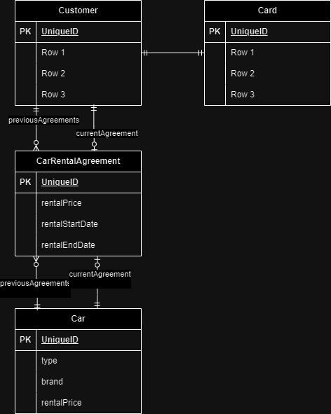
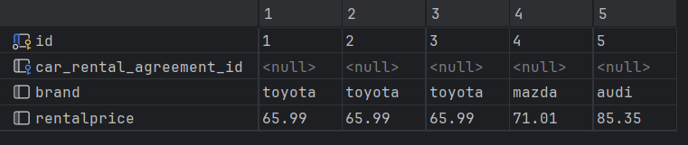
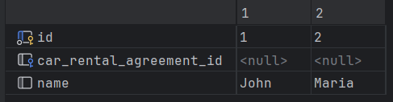
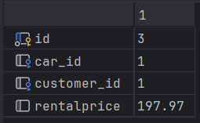

# Lesson 2 - Transactions: The A in ACID

Transactions lets a client of the database execute several instructions, as if
they were one. This is useful, to let them all succeed or none at all. It also
isolates the complete change from intermittent changes done outside the
transaction.

To illustrate the above two mentioned use cases, let's first look at a data
model that requires proper transaction handling to prevent inconsistent data
states.

# Data model

The data model models a car rental company. Every customer has a card, that can
be used to access certain car parking boxes, lockers at company offices (handy
when you are in the neighbourhood), and it stores the points.

When a customer rents a car, an agreement is drafted with all the details. The
history of cars that were rented is also tracked.



<details>

```sql
create table car_rental_agreement (
  id integer PRIMARY KEY GENERATED BY DEFAULT AS IDENTITY
 ,car_id integer
 ,customer_id integer
 ,rentalPrice NUMERIC(9,2) -- Precision 9 means 7 left of decimal point and 2 right side.
);

create table car (
  id integer PRIMARY KEY GENERATED BY DEFAULT AS IDENTITY
 ,car_rental_agreement_id integer references car_rental_agreement
 ,brand TEXT
 ,rentalPrice NUMERIC(9,2) -- Precision 9 means 7 left of decimal point and 2 right side.
);

create table customer (
  id integer PRIMARY KEY GENERATED BY DEFAULT AS IDENTITY
 ,car_rental_agreement_id integer references car_rental_agreement
 ,name TEXT
);

ALTER TABLE car_rental_agreement
ADD CONSTRAINT fk_car_rental_agreement_car
FOREIGN KEY (car_id) REFERENCES car(id);

ALTER TABLE car_rental_agreement
ADD CONSTRAINT fk_car_rental_agreement_customer
FOREIGN KEY (customer_id) REFERENCES customer(id);

```

</details>

# Use cases for transactionality

Looking at our data model, let's see what operations we have going on, governed
by the business rules:

### 1. New Rental agreement

When a customer signs a rental agreement, a new CarRentalAgreement row is
created. It is linked to the Customer and the Car entities. This new row it's
primary key, then has to be set in both the Car and Customer rows and
persisted to the database.

### 2. Rental agreement ends

For the sake of simplicity, and didactic reasons, we will keep a rental agreement
open, until the renter, brings back the car. That event will trigger an update.
In the real world you have other situations and subsequent events that trigger
changes, but we will leave them as is and move on with this simple setup.

When the car is returned, the end date needs to be set in the car rental agreement,
also, the car and customer entities need to be updated, to not be pointing to the
agreement row in the database. These are all individual sql update statements.

## Problem description

When either use case 1 or 2 is fulfilled, several updates to the database
are done. If in between, another update is done, then undesired states might be
reached. Therefore, transactions can help, by having a group of statements being
executed atomically, as if it was one update statement to the database.

### Example 1

Let's take use case 1 as an example. First some data to populate the database:

```postgresql
insert into car
    (brand, rentalprice)
VALUES
    ('toyota', 65.99),
    ('toyota', 65.99),
    ('toyota', 65.99),
    ('mazda', 71.01),
    ('audi', 85.35);

insert into customer (name)
values ('John'), ('Maria');
```

Now let's imagine, John, a customer, comes to the car rental service one day,
and desires to rent one of the Toyota's (the author does not receive any money
from marketing the brands mentioned here...). He is asked:

__*"For how many days, sir?".
"Hmmm... good question, I will be gone for a while, going to the country
side. You know, visiting the old folk, just a weekend out you know... Always
good..."*__

__*"Sir! Please, there are other customers..."*__

__*"3 days..."*__

So we need to create a new contract, for a Toyota, registered to "John", for
three days. The SQL looks then like:

```sql

select * from car;
select * from customer;
```




```postgresql

insert into car_rental_agreement
(car_id, customer_id, rentalprice)
VALUES (1,
         (select id from customer where name = 'John'),
         (select 3 * (select car.rentalprice
                      from car
                      where id = 1))
    );

```



But we are not done yet!

Now we have to set the newly created agreement, as the current agreement active
in the car and customer entities. For the car entity this is important, so it
will not be booked double. For the customer, so it is registered that the
customer is renting a car and also which one.

Let's do this:

```postgresql
update car
set car_rental_agreement_id = 3
where id = 1;

update customer
set car_rental_agreement_id = 3
where id = 1;
```

What we have now, is a new contract for John, registered for renting a Toyota,
for three days. But, this was done with separate SQL statements. We didn't use
transactions. Nothing went wrong while we did the above updates to the database.
However, imagine now, multiple service employees, talking to separate customers
at the same time, and others, not only John, wish to rent a Toyota. Now things
can go terribly wrong. Let's look an example what can go wrong, and first list
the steps we took, to more easily see the process of what we just did above.

1. Read the available cars and find the customer that is at the desk
2. Create a new agreement taking the id of one of the available cars of given
   brand, and the id of the person at the desk.
3. Update both the car and customer entities, with the id of the newly created
   agreement in the database.

